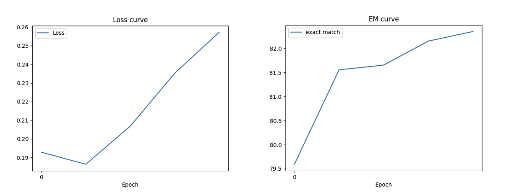

# Homework2 ADL NTU 109 Spring
## Training
### Enviornment
```bash=
# If you have conda, we recommend you to build a conda environment called "adl"
conda env create -f environment.yml
make
# otherwise
pip install -r requirements.txt
```

### Question Answering & Multiple Choice
```bash=
bash train.sh
```

## Inference
```bash=
bash download.sh
bash run.sh /path/to/context.json /path/to/test.json /path/to/pred/prediction.csv
```

## Model

### Model link
https://www.dropbox.com/sh/u5oitlt7b79r6ki/AAD6PjPs7ZsIxDDUAhw7eVrda?dl=0

### Multiple Choice
<code>hfl/chinese-roberta-wwm-ext</code>

```python=
tokenizer = AutoTokenizer.from_pretrained("hfl/chinese-roberta-wwm-ext")

model = AutoModelForMultipleChoice.from_pretrained("hfl/chinese-roberta-wwm-ext")
model.resize_token_embeddings(len(tokenizer))
model.to(args.device)
```

### Question Answering
<code>hfl/chinese-roberta-wwm-ext</code>

```python=
tokenizer = AutoTokenizer.from_pretrained("hfl/chinese-roberta-wwm-ext")

model = AutoModelForQuestionAnswering.from_pretrained("hfl/chinese-roberta-wwm-ext")
model.resize_token_embeddings(len(tokenizer))
model.to(args.device)
```

### Loss curve & exact match curve



## 實驗紀錄

| Model Name (both same) | public leader board | lr | max_length MC | max_length QA | doc_stride QA | postprocess QA max_length | postprocess QA doc_stride |  others |
| ---- | ------- | -- | ----------- | ---------- | ------- | ------ | ------- | ----------------- |
| bert-base-chinese | 0.705 | 3e-5 | 384 | 384 | 128 | 384 | 128 | - |
| hfl/chinese-bert-wwm-ext | 0.713 | 3e-5 | 384 | 384 | 128 | 384 | 128 | - |
| hfl/chinese-bert-wwm-ext | 0.748 | 3e-5 | 384 | 459 | 128 | 459 | 350 | Change preprocess function of QA. QA inference question length 50, ans length 35. |
| hfl/chinese-macbert-base | 0.764 | 3e-5 | 384 | 459 | 128 | 459 | 350 | same as above |
| hfl/chinese-roberta-wwm-ext | 0.776 | 3e-5 | 384 | 459 | 128 | 459 | 350 | same as above |
| hfl/chinese-roberta-wwm-ext | 0.781 | 3e-5 | 384 | 512 | 192 | 512 | 192 | same as above |